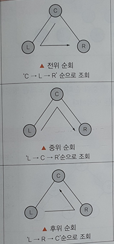

# 논리 데이터 저장소

# 자료 구조의 분류

| 구조 | 설명 | 종류 |
| --- | --- | --- |
| 선형 구조 | 데이터를 연속적으로 연결한 자료 구조 | 리스트, 스택, 큐, 데크 |
| 비선형 구조 | 데이터를 비연속적으로 연결한 자료 구조 | 트리, 그래프 |

# 선형구조

## 리스트

| 리스트의 종류                   | 설명                                                                                                                             |
|---------------------------|--------------------------------------------------------------------------------------------------------------------------------|
| 선형 리스트   (Linear List) | - 연속적   - 대표적인 구조 배열(Array)   - 접근 구조가 빠름   데이터의 삽입, 삭제 시 기존 자료의 이동이 필요                                               |
| 연결 리스트   (Linked List) | - 노드의 포인터 부분으로 서로 연결시킨 리스트   - 단순 연결 리스트, 원형 연결 리스트, 이중 연결 리스트, 이중원형 연결 리스트로 구분   - 노드의 삽입, 삭제 시 편리   - 선형 리스트에 비해 느림 |

## 스택

- 한 방향으로만 PUSH와 POP을 이용하여 자료를 넣고 꺼낸다.
- LIFO
- TOP(=Stack Pointer) : 가장 위에 있는 데이터

| 연산 | 코드                                                                                     |  |
| --- |----------------------------------------------------------------------------------------| --- |
| 삽입 | If Top = n Then   Overflow   Else {  Top = Top +1   insert S(Top)   }   | - 삽입할 공간이 없으면 오버플로 |
| 삭제 | If Top = 0 Then   Underflow   Else {   remove S(Top)   Top = Top -1   } | - 삭제할 데이터가 없으면 언더플로 |
- 스택 응용 분야
    - 인터럽트의 처리
    - 함수 호출(재귀 호출 포함)
    - 후위표현 연산
    - 깊이 우선 탐색(DFS)

## 큐

- 한쪽에서는 ENQUEUE로 데이터를 넣고, 반대쪽에서는 DEQUEUE로 데이터를 꺼낸다.
- FIFO

## 데크(Deque : Double Ended Queue)

- 큐의 양쪽 끝에서 삽입(PUSH)과 삭제(POP)를 할 수 있다.
- 두 개의 포인터를 사용한다.

# 비선형 구조

## 트리

- 데이터들을 계층화시킨 자료 구조
- 노드(Node)와 링크(Link)로 구성
- 정점 사이에 사이클(Cycle)이 형성되어 있지 않다.
- 깊이(Depth) : 간선의 수(루트 노드에서 특정 노드에 도달하기 위한 간선)
- 차수(Degree) : 자식 노드의 수

### 트리 순회 방법

| 방법                               | 설명 |
|----------------------------------| --- |
| 전위 순회   (Pre-Order Traversal) | Root → Left → Right |
| 중위 순회   (In-Order Traversal)  | Left → Root → Right |
| 후위 순회   (Post-Order Traversal) | Left → Right → Root |

### 트리 종류

- 이진 탐색 트리 : 차수(자식 노드)가 2이하인 노드로 구성
    - 왼쪽 노드 : 부모 노드보다 작은 값
    - 오른쪽 노드 : 부모 노드보다 큰 값
- AVL 트리
    - 두 자식 서브 트리의 높이가 항상 최대 1만큼만 차이
- 2-3 트리
- 레드-블랙 트리

## 그래프

- 노드와 노드를 연결하는 간선을 하나로 모아 놓은 자료 구조
- cf. 트리 : 사이클이 없는 그래프

### 그래프의 유형

- 방향 그래프
    - 최대 간선 수 : n(n-1)
- 무방향 그래프
    - 최대 간선 수 : n(n-1)/2

### 그래프 탐색 방법

- 깊이 우선 탐색(DFS)
- 너비 우선 탐색(BFS)